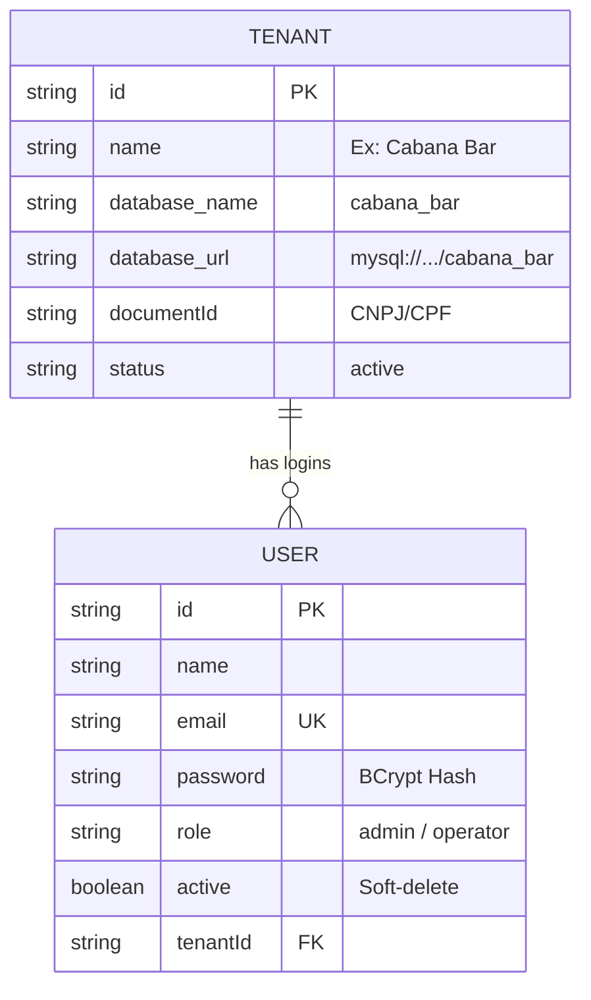
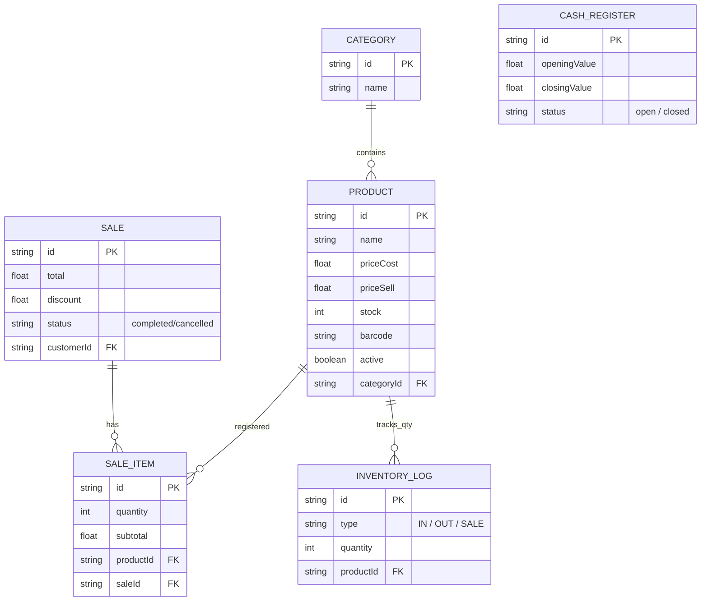

# 7bar SaaS POS - Estratégia de Banco Multitenant e Isolamento

Este documento detalha o core do sistema. Todo o faturamento, produtos e controle baseia-se na separação estrita chamada **Database per Tenant**.

## 1. O que significa "Database per Tenant"?
A aplicação enxerga e opera em dois níveis diferentes de Banco de Dados: o banco Mestre e os sub-bancos. O Prisma foi configurado emitindo DOIS "PrismaClients" independentes (`@prisma/client-heart` e `@prisma/client`).

### 1.1 O Banco Central (`heart`)
Este é o cérebro que gerencia as "Assinaturas" ou Lojas base. Todas as conexões vindas do Frontend primeiro consultam o Heart para validação matemática e contratual.
- **Contém:** Todos os domínios do sistema (`Tenants`) de ponta a ponta. Senhas, permissões, IDs Fiscais, Certificados A1 de todos os assinantes, Planos.
- **Acesso:** Somente a API Rest na rota de Identificação/Autenticação encosta nele.

### 1.2 Os Bancos dos Lojistas (`tenant` DBs)
Para cada Tenant criado no banco Heart, **nasce um schema de banco de dados exclusivo** carregando as tabelas reais do Software de Vendas.
- Se o Bar "Adega 7 Belo" for registrado, o código rodará a Query de criação do DB: `CREATE DATABASE IF NOT EXISTS \`adega7belo\``.
- **Contém:** Estoque (Products, Categories, InventoryLogs), Caixa (CashMovements), Movimento (Sales, SaleItems) e Clientes (Customers).

---

## 2. Diagrama Entidade-Relacionamento do "Biótipo" Multitenant

### A - Prisma Heart Schema (Banco Mestre)

### B - Prisma Tenant Schema (Bancos das Lojistas Dinâmicos)
*(Toda Lojista carregará essa modelagem dentro de seu domínio independente).*

## 3. Comportamento de Soft Delete em Cascata
Foi tomada a decisão de não excluir permanentemente os colaboradores demitidos do painel para garantir que as **auditorias de frente de caixa e sangrias** assinadas pelo colaborador não se percam.

- O campo `active` booleano foi adicionado na tabela central de Usuários (`users`).
- **Validação:** A camada de Auth do NestJS inspeciona essa tag e chumbou o bloqueio (Lança Error 401 Unauthorized) se ela estiver falsa (Acesso Bloqueado pelo Administrador da Franquia), protegendo o Banco Lojista.
