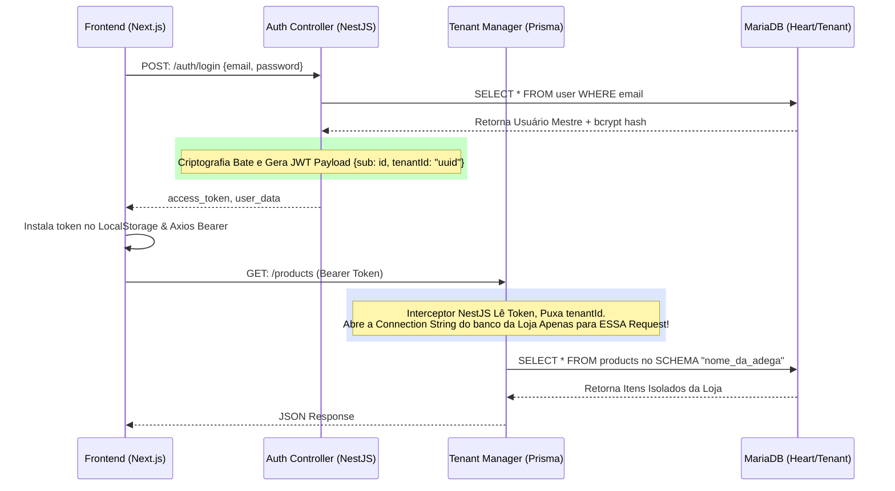

# 7bar SaaS POS - Fluxo de Comunicação e Segurança API

Como as requisições se movem do Clique do Usuário até os bancos de dados separados sem se misturar.

## 1. O Pipeline da Requisição HTTP (Next.js -> NestJS)
Para o isolamento dos clientes no **Backend**, o Prisma foi estendido utilizando o padrão `Tenant Connection Manager`. 

Aplica-se uma estratégia onde o NestJS captura qual Banco de Dados abrir baseado puramente na chave contida no JWT (JSON Web Token), injetada no header pelo Axios do Frontend. Nenhuma tela precisa informar "Eu sou do Bar X", o sistema obriga e descobre isso sozinho pelo Token de acesso de quem logou.

## 2. Diagrama de Sequência de Acesso Dinâmico (JWT to BD)

## 3. O Roteamento de Portas e CORS
No servidor oficial hospedado no **Portainer**, os fluxos de rede operam ativamente sobre portas blindadas mapeadas:
- O frontend Next.js aceita o tráfego Web HTTP pela porta `3521`.
- A API rest base do NestJS processa requisições via `3520`. O CORS foi aberto globalmente na configuração do `main.ts` para que somente a Web consiga se conectar aos Endpoints do Swagger/JSON.
