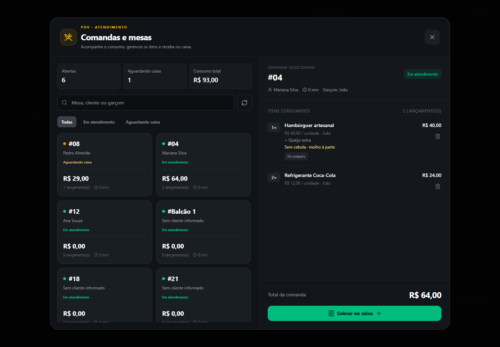
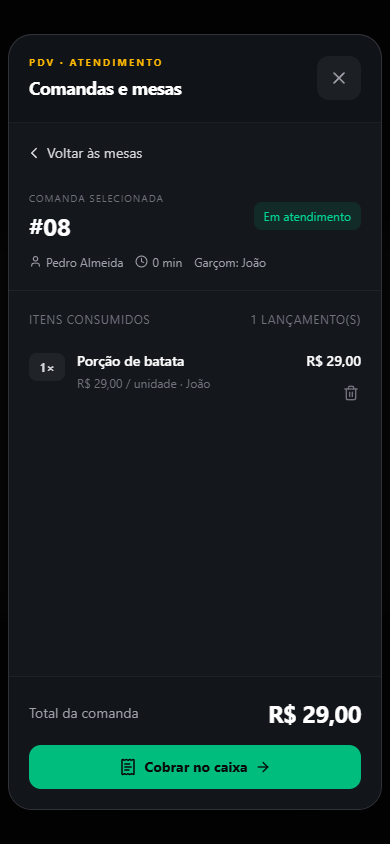

# PDV — Comandas e mesas no caixa

Atualização de 15/09/2026. Frontend local reconstruído e atualizado em localhost:3521; HTTP 200 e bundle novo confirmados. As duas janelas do caixa (consulta/cobrança e lançamento pelo pagamento) compartilham `ComandaWorkspaceModal`.

## Interface

- Painel amplo em duas colunas no computador, com resumo de comandas abertas, aguardando caixa e consumo total.
- Busca por mesa, cliente ou garçom, tolerante a acentos; filtros por status e prioridade para quem solicitou fechamento.
- No celular, navegação entre lista de mesas e detalhe, mantendo os itens roláveis e as ações visíveis.
- Detalhe com quantidade, preço unitário, total por linha, adicionais, observações, operador e estado KDS.
- Abertura de nova comanda com identificação obrigatória e cliente opcional. O Enter no campo de identificação confirma o lançamento, como no fluxo anterior.
- Atualização a cada 15s e botão manual. Erros de consulta ficam visíveis; o detalhe é lido do servidor novamente antes de cobrar.

## Remover um item

1. Selecione a comanda no caixa, inclusive na janela de lançamento.
2. Clique na lixeira da linha desejada.
3. Confira produto, quantidade e valor; confirme **Remover item**.

A operação remove a quantidade inteira daquele lançamento. Usa o endpoint existente `DELETE /v1/comandas/:comandaId/items/:itemId`, com as mesmas regras do garçom: estorno do estoque debitado (ou snapshot dos ingredientes de compostos), recálculo do total e manutenção da comanda aberta. Não faz venda nem fecha a conta. O item também deixa de aparecer na fila ativa do KDS.

Comanda `waiting_payment` precisa ser reaberta por **Reabrir para editar**, com confirmação explícita. Encerradas/canceladas seguem bloqueadas. A interface não altera regras de permissão do backend.

## Cobrança e carrinho

- Remover de uma comanda já carregada atualiza apenas as linhas importadas dessa comanda; acréscimos feitos no caixa permanecem no carrinho.
- O carregamento utiliza `unitPrice` e `totalPrice` retornados pelo servidor. O adicional de produto composto não é somado novamente a um preço que já o inclui.
- Ao modificar a comanda carregada pela janela de pagamento, pagamentos e desconto em rascunho são limpos para evitar cobrança com valores antigos.
- Substituir um carrinho existente por outra comanda exige confirmação.
- Itens já importados de uma comanda não podem ser relançados como novo consumo. Se criação da comanda funcionar e o lançamento falhar, a próxima tentativa usa a comanda criada.
- Atalhos de pagamento ficam suspensos durante a janela de comandas. Escape fecha primeiro a confirmação interna; Tab fica contido na janela.

## Validação

- 34 testes de backend aprovados: remoção simples/composta, status bloqueados, vínculo item/comanda, KDS, lançamento e regressão de vendas.
- Teste de navegador com API simulada em `frontend/scripts/comandas-ui-test.cjs`: busca, cancelamento e falha de remoção, remoção com atualização do total, reabertura, comanda vazia preservada, cobrança com adicionais, edição de comanda já no carrinho preservando acréscimos, lançamento pela janela de pagamento e layout desktop/mobile. Sem erros JavaScript.
- Build Vite/PWA aprovado. A checagem TypeScript continua apontando os 36 erros preexistentes já identificados na tarefa anterior; nenhum erro nos arquivos novos/alterados desta mudança.
- Não houve migração, alteração de schema ou teste destrutivo em dados reais. A atualização local envolve apenas o frontend; publicação no domínio de produção é uma etapa separada.

Para repetir a validação de interface, iniciar Vite em `127.0.0.1:4178` e rodar `node frontend/scripts/comandas-ui-test.cjs`. Requer Playwright/Edge; `PLAYWRIGHT_MODULE` permite usar uma instalação externa e `COMANDA_SCREENSHOT_DIR` define a pasta das capturas.

