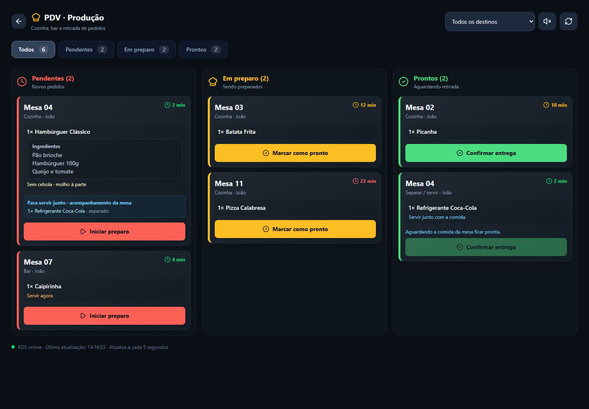
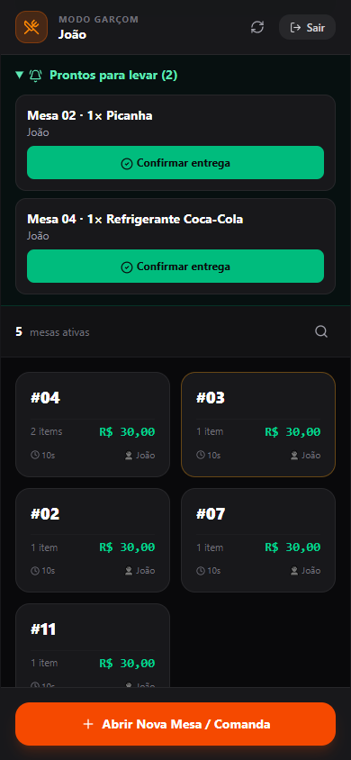
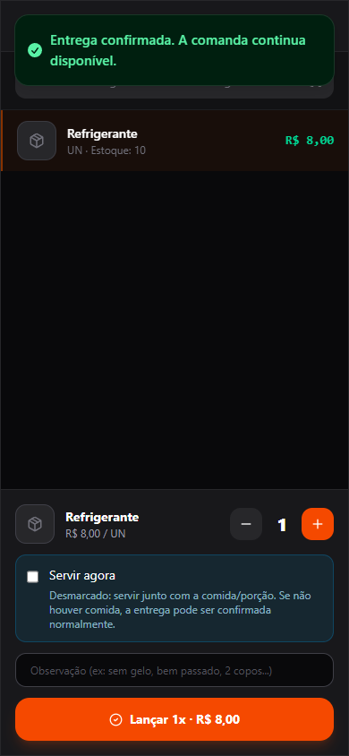

# PDV — KDS: implementação e ativação

Implementação local de 13/09/2026. Banco de dados e produção **não foram alterados** nesta execução. A ativação depende da atualização dos schemas pelo usuário no Sys-Init.

## 🥔 14/09/2026 — Ingredientes nos cards do KDS

- A API GET /v1/kds/tickets retorna preparationIngredients do cadastro do produto.
- Em 14/09, builds backend/frontend e teste de interface aprovados. Containers locais backend/frontend reconstruídos e atualizados em localhost:3521, sem executar atualização de banco.
- Cards de todas as etapas exibem o bloco Ingredientes quando houver conteúdo, preservando quebras de linha e permitindo quebra de palavras longas. Valores nulos/vazios ou só espaços não geram bloco.
- Ingredientes são consultados do cadastro atual, separados das observações e dos adicionais do pedido. Sem mudança em schema, estoque, preços ou transições.

## Plano revisado e implementado

1. Campos aditivos no schema, sem renomear/remover tabelas ou dados.
2. Módulo opt-in `modulos.kds` no Heart, no mesmo mecanismo dos demais módulos. Ausente/false significa desligado. Não existe um segundo `TenantSettings.enableKds` para divergir dessa configuração.
3. Destino por produto: `requiresKitchen` ou `requiresBar`, ambos false por padrão e mutuamente exclusivos. `preparationIngredients` é texto opcional (até 5000 caracteres). A composição/baixa de ingredientes existente não foi substituída.
4. Snapshot do destino e estado no item da comanda; cadastro posterior não redireciona pedidos já lançados.
5. Rota autenticada `/kds` no React Router/Vite. Não é uma rota Next.js nem um endpoint público com token compartilhado.
6. Painel escuro com Pendentes, Em preparo e Prontos, filtros por destino/status, observações, adicionais, garçom e tempo de espera. Pedidos mais antigos primeiro. Som habilitado pelo botão no próprio dispositivo, inicialmente desligado; polling a cada 5s, timeout de leitura de 10s e erro visível de conexão.
7. Retirada na área do garçom: confirmação explícita de entrega. Sai apenas da fila de produção/retirada, preservando item, valores, estoque e comanda.
8. Validação automatizada de regras/serviços, regressão de vendas e UI com API simulada; documentação e evidências salvas.

## Bebidas: agora ou junto

- Check **Servir agora** inicialmente desmarcado, visível para produtos que não são de cozinha, somente com KDS ativo.
- Marcado: bebida pode ser entregue independentemente da comida. Um produto de bar ainda precisa ser preparado antes de ficar pronto.
- Desmarcado: bebida acompanha a comida. A confirmação de entrega é bloqueada no servidor enquanto houver item de **cozinha** pendente/em preparo na mesma comanda.
- Produto sem preparo, lançado pelo garçom com preferência explícita: destino `SERVICE`, já disponível para retirada. Não precisa passar por dois cliques de preparo.
- Bebidas para acompanhar aparecem também no card da cozinha, como contexto; a entrega é confirmada na fila correspondente.
- A associação é por **comanda**, não por prato individual/rodada. Havendo várias comidas em preparo, a bebida espera todas. Se ainda não houver comida lançada, ou todas já estiverem prontas/entregues, a retirada é permitida. Para pedidos mistos, lançar todos os itens antes de confirmar a entrega.
- Clientes antigos que não enviam `serveImmediately` mantêm produtos sem flags fora do KDS. Com o módulo desligado, nenhum lançamento entra nesse fluxo.

## Persistência e proteção

`Product`: `requiresKitchen=false`, `requiresBar=false`, `preparationIngredients=null`.

`ComandaItem`: `kdsDestination`, `kdsStatus`, `kdsSentAt`, `kdsReadyAt`, `kdsDeliveredAt` opcionais; `serveImmediately=false`. Índice em status/data de envio. Itens anteriores permanecem com estado KDS nulo; não há backfill operacional.

Ciclo de produção: `PENDING → PREPARING → READY → DELIVERED`. Itens sem preparo entram em `READY`. Não há retorno, salto de etapas ou reabertura de entregues pelo KDS.

Atualizações usam transação, bloqueio da linha da comanda sem escrita nela, isolamento ReadCommitted e comparação do status anterior. Lotes são atômicos (1–100 IDs distintos). Comandas fechadas/canceladas e itens removidos deixam a fila. Comandas aguardando pagamento permanecem visíveis. Fechamento, cancelamento, preços, auditoria e cálculo de estoque mantêm os fluxos anteriores.

Todos os endpoints usam JWT e o banco do tenant da sessão:

| Método | Rota | Função |
|---|---|---|
| GET | `/v1/kds/config` | Consulta ativação |
| GET | `/v1/kds/tickets` | Itens pendentes, em preparo e prontos de comandas ativas |
| PATCH | `/v1/kds/status` | `{ "itemIds": ["id"], "status": "PREPARING/READY/DELIVERED" }` |

## Ativação segura pelo Sys-Init

1. Disponibilizar esta versão e o schema no ambiente escolhido, em janela controlada. Começar pela loja de testes e manter backup restaurável antes de atualizar produção.
2. **O usuário deve clicar em Sys-Init → Gestão de Tenants → Atualizar Bancos.** Atualizar todos os bancos que utilizarão o novo backend, inclusive lojas com KDS desativado: o cliente Prisma novo espera as colunas aditivas também nessas lojas. Não retomar operação com backend novo e schema antigo.
3. Conferir o resultado de cada tenant. O caminho de atualização agora recusa mudanças que o Prisma identifique como risco de perda: foi removido `--accept-data-loss` na atualização de bancos existentes. Se houver divergência de schema, diagnosticar o erro antes de continuar; não forçar perda de dados.
4. Ativar **KDS — Cozinha e Bar** somente nas lojas desejadas. Ativar o módulo Restaurante/Garçom conforme o acesso necessário.
5. Recarregar a aplicação, marcar os produtos desejados como cozinha/bar e preencher ingredientes somente se necessário.
6. Abrir `/kds` com uma sessão autenticada e testar uma comanda completa antes da liberação operacional.

Nenhum comando `prisma migrate` ou `prisma db push` foi executado nesta implementação. Apenas o cliente Prisma local foi gerado para compilação. A migração real e a homologação com banco continuam pendentes da ação no Sys-Init.

## Validação

- Backend: build Nest aprovado.
- Frontend: build Vite/PWA aprovado; mantém avisos de tamanho do bundle/importação de XLSX.
- Jest: 27 testes aprovados em KDS, lançamento simples/composto, resiliência e entrega de vendas.
- TypeScript comparado com HEAD usando as mesmas dependências: 37 erros anteriores, 36 atuais, nenhum erro novo. Corrigido o callback de leitura de código de barras do garçom (`onDetected` → `onScan`). Os demais erros preexistentes estão fora do escopo do KDS.
- Navegador Edge headless, API totalmente simulada: desktop 1440px, celular 390px, filtros, transições, trava de bebida junto, preferência marcado/desmarcado enviada ao backend, indisponibilidade de rede, retirada do garçom, comanda preservada e módulo desativado. Sem erros JavaScript.
- Não executado: migração/MySQL real, carga concorrente em banco e operação fiscal real. Os testes não substituem a homologação após o Sys-Init.

Executar backend: `npm test -- --runInBand kds.spec.ts comandas-kds.spec.ts sales-resilience.spec.ts sales-delivery.spec.ts` dentro de `backend`.

Executar UI: iniciar Vite em `127.0.0.1:4178`; executar `node frontend/scripts/kds-ui-test.cjs` com Playwright disponível (`PLAYWRIGHT_MODULE` aceita o caminho de uma instalação externa). O teste abre Edge headless e intercepta todas as chamadas `/api/`; não utiliza bancos reais. `KDS_SCREENSHOT_DIR` define onde salvar capturas.

### Homologação após atualizar bancos

- Conferir produto e comanda antigos: valores, estoque e cobrança preservados, flags false e status KDS nulo.
- Loja sem KDS: lançar e fechar uma comanda pelo fluxo habitual.
- Loja com KDS: lançar comida, bebida junto e bebida agora; confirmar transições e entrega.
- Remover um item, cancelar uma comanda e fechar outra pelo caixa; conferir saída da fila e regras anteriores de estoque/cobrança.
- Confirmar que produtos compostos mantêm adicionais e consumo de ingredientes.
- Em duas telas, tentar atualizar o mesmo pedido; a segunda deve receber conflito sem duplicar entrega.

## Evidências visuais (dados simulados)

